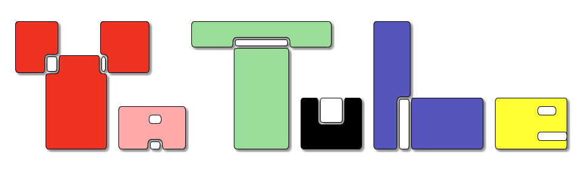

- [Tech Stack](#org44146c0)
- [Run project in DEV-Mode](#org92ed860)
- [How to check your models](#org8365dc7)



    __   __   _____      _            ____            _           _
    \ \ / /_ |_   _|   _| |__   ___  |  _ \ _ __ ___ (_) ___  ___| |_
     \ V / _` || || | | | '_ \ / _ \ | |_) | '__/ _ \| |/ _ \/ __| __|
      | | (_| || || |_| | |_) |  __/ |  __/| | | (_) | |  __/ (__| |_
      |_|\__,_||_| \__,_|_.__/ \___| |_|   |_|  \___// |\___|\___|\__|
                                                   |__/

Social network for bloggers.


<a id="org44146c0"></a>

# Tech Stack

-   **Client:** Python 3.7, Django 2.2.19
-   **Server:** Windows/Linux/MacOS/FreeBSD


<a id="org92ed860"></a>

# Run project in DEV-Mode

1.  Install and activate virtual environment

    ```shell
    python -m venv venv
    # For Linux/MacOS
    source venv/bin/activate
    # For Windows
    source venv/Scripts/activate.sh
    ```
2.  Install dependencies

    ```shell
    pip install -r requirements.txt
    ```
3.  Migrate models to database

    ```shell
    python manage.py migrate
    ```
4.  Create a superuser

    ```shell
    python manage.py createsuperuser
    ```
5.  Run

    ```shell
    python manage.py runserver
    ```


<a id="org8365dc7"></a>

# How to check your models

1.  Go to Django-shell

    ```shell
    source venv/bin/activate
    python manage.py shell
    ```
2.  Check your users models

    ```python
    from posts.models import User

    all_users = User.objects.all()
    ```
