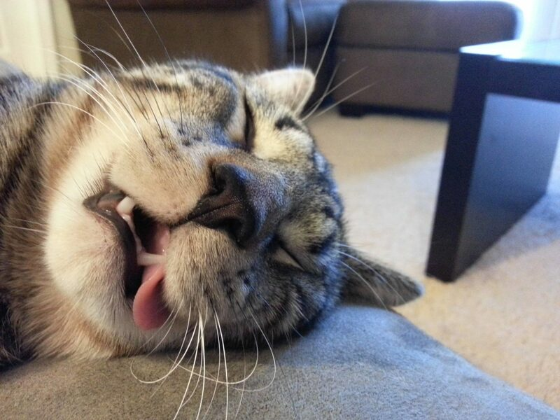
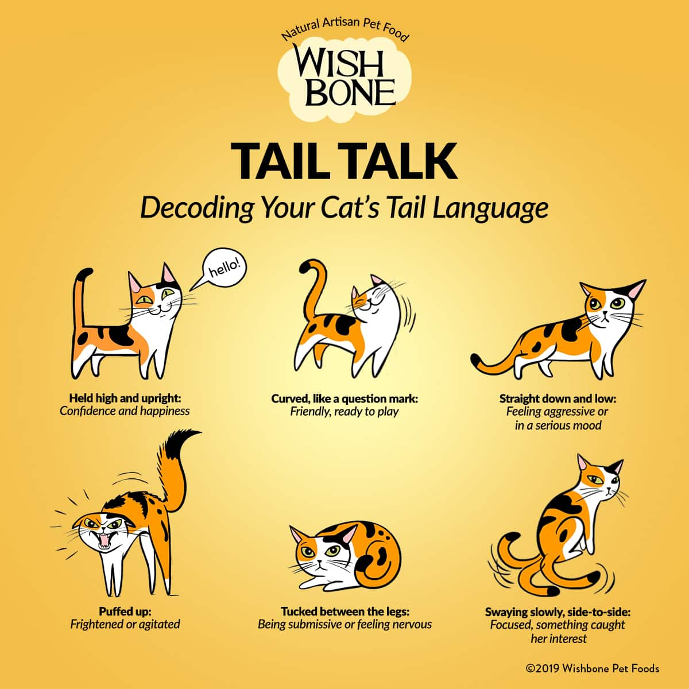
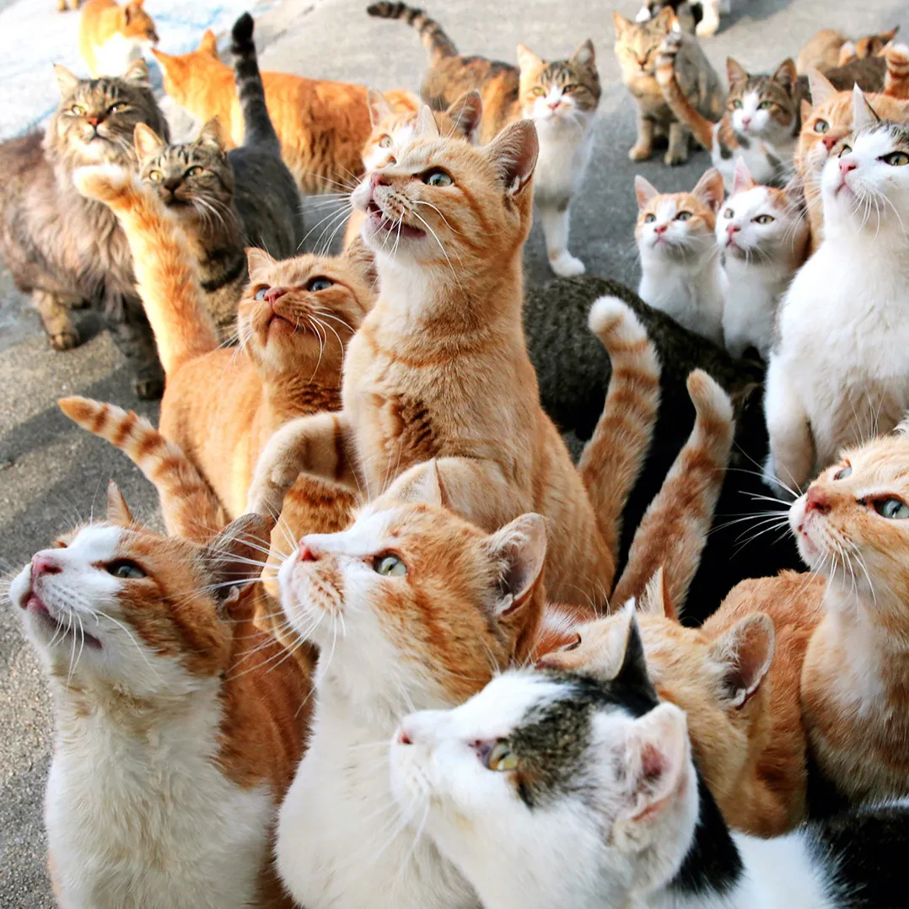
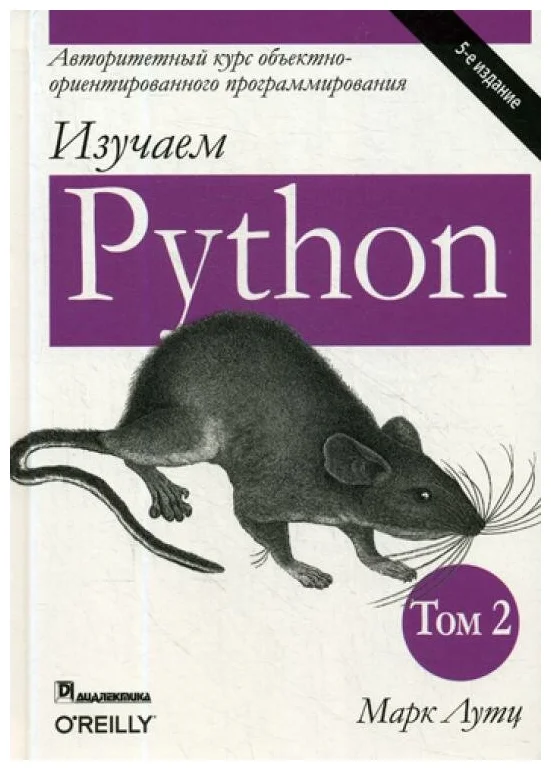

- [Что было до ООП](#org110f157)
- [Класс](#orgdc2cea0)
- [Объект](#org879958a)
- [Объект](#org0233527)
- [Метод](#orgc6a24b7)
- [Атрибут](#orgdaf967a)
- [Атрибут класса](#org1d20df3)
- [self](#org795e88c)
- [self](#org67f18d8)
- [Инициализация](#orge4eec9e)
- [Инициализация](#org95b5693)
- [@dataclass](#orgbbbe4fb)
- [@dataclass](#org58f8369)
- [@dataclass](#orgffa7cce)
- [Наследование](#org0223221)
- [Наследование по-простому](#org994d567)
- [super](#org912c7ef)
- [super](#org665efcb)
- [Полиморфизм](#org9b02d52)
- [Инкапсуляция](#org8fc0378)
- [Инкапсуляция](#org622d7bc)
- [Инкапсуляция](#org071d928)
- [setter / getter](#org553ed78)
- [setter/getter](#org260609e)
- [Статические методы](#org3724692)
- [Статические методы](#org5673d5f)
- [В Python всё есть объект](#org3b58232)
- [Дополнительная литература](#org99af5c3)
- [Вопросы-ответы](#org8d8e1f7)


<a id="org110f157"></a>

# Что было до ООП

Код был **императивным**, то есть команды построчно выполнялись  

```python
counter = 0
while counter <= 3:
    counter += 1
    print(f"Step {counter}")

counter = 0
result = 0
while counter <= 3:
    result += counter
    counter += 1
```


<a id="orgdc2cea0"></a>

# Класс

```python
class Animal(object):
    ...

class Cat(Animal):
    ...
```

  


<a id="org879958a"></a>

# Объект

```python
a_cat = Cat(type="египетский")
```

  


<a id="org0233527"></a>

# Объект

```python
a_cat = Cat(type="кроличий")
```

  


<a id="orgc6a24b7"></a>

# Метод

```python
class Cat(Animal):
    ...
    def sleep(self, period):
        self.activity = None
        time.sleep(period)
```

  


<a id="orgdaf967a"></a>

# Атрибут

```python
class Cat(Animal):
    tail_state = 'puffed up'
    ...
```

  


<a id="org1d20df3"></a>

# Атрибут класса

Так мы говорим, что у всех кошек на Земле хвост задран  

```python
class Cat(Animal):
    tail_state = 'puffed up'
    ...
```

А так только у какой-то конкретной кошки (у конкретного экземпляра объекта класса *Cat*)  

```python
class Cat(Animal):
    def __init__(self):
        self.tail_state = 'puffed up'
    ...
```


<a id="org795e88c"></a>

# self

-   **self:** это указать на конкретный экземпляр объекта класса.

  


<a id="org67f18d8"></a>

# self

```python
class Cat(Animal):
    def meow(self):
        print('Meow')

cat_1 = Cat()
cat_2 = Cat()
cat_3 = Cat()
cat_1.meow()
# Кто сказал "мяу"?
```


<a id="orge4eec9e"></a>

# Инициализация

```python
class Cat(Animal):
  def __init__(self,
               age,
               breed,
               color_schema,
               tail_state,
               is_domestic=False,
               family=None):
      self.age = age
      self.breed = breed
      self.color_schema = color_schema
      self.tail_state = tail_state,
      self.is_domestic = is_domestic
      self.family = family
```


<a id="org95b5693"></a>

# Инициализация

```python
def take_cat(self, family):
  if self.is_domestic:
      raise Exception(
        'Это домашняя кошка!'
        ' Её нельзя забрать!'
      )
  self.is_domestic = True
  self.family = family
```


<a id="orgbbbe4fb"></a>

# @dataclass

<span class="underline"><span class="underline">[документация](https://docs.python.org/3.8/library/dataclasses.html)</span></span>  

```python
from dataclasses import dataclass

@dataclass
class Cat(Animal):
    age: int
    breed: str
    color_schema: int
    tail_state: int
    is_domestic: bool = False
    family: object = None
```


<a id="org58f8369"></a>

# @dataclass

<span class="underline"><span class="underline">[документация](https://docs.python.org/3.8/library/dataclasses.html)</span></span>  

```python
class Cat(Animal):
  def __init__(
    self, age: int, breed: str,
    color_schema: int, tail_state: int,
    is_domestic: bool=False,
    family: object=None
  ):
    self.age = age
    self.breed = breed
    self.color_schema = color_schema
    self.tail_state = tail_state,
    self.is_domestic = is_domestic
    self.family = family
```


<a id="orgffa7cce"></a>

# @dataclass

```python
@dataclasses.dataclass(
    *, init=True, repr=True, eq=True,
    order=False, unsafe_hash=False,
    frozen=False
)
```


<a id="org0223221"></a>

# Наследование

```python
class Animal:
    def say(self):
        raise NotImplementedError()

class Cat(Animal):
    def say(self):
        print('meow!')

class Dog(Animal):
    def barking(self):
        # что произойдёт?
        return self.say()
```


<a id="org994d567"></a>

# Наследование по-простому

Наследование это всего лишь порядок, по которому будет идти поиск атрибутов и методов.  

```python
# class A(object):
class A:
    attr = 10
    def method(self):
        print("method")

class B(A):
    attr = 20
    def function(self):
        print("function")
```


<a id="org912c7ef"></a>

# super

$super()$ возвращает объект родителя, чтобы мы могли запросить нужный нам метод/атрибут у родителя  

```python
class B(A):
    def function(self):
        super().method()
        (
            self.__class__
            .__bases__[0]
            .method(self)
        )
        print("function")
```


<a id="org665efcb"></a>

# super

```python
b = B()
b.function()
```

    method
    method
    function


<a id="org9b02d52"></a>

# Полиморфизм

```python
def listen_to_animal(animal: Animal):
    animal.say()

a_cat = Cat()
a_dog = Dog()
listen_to_animal(a_cat)
listen_to_animal(a_dog)
```


<a id="org8fc0378"></a>

# Инкапсуляция

-   переменные и методы с одним подчёркиванием **\_name** программисты договорились считать внутренними переменными
-   переменные и методы с двойным подчёркиванием **\_ \_name** Python прячет особым образом (но к ним всё ещё можно получить доступ)


<a id="org622d7bc"></a>

# Инкапсуляция

```python
class A:
    x = 10
    _y = 20
    __z = 30

a = A()
print(a.x)    # -> 10
print(a._y)   # -> 20
print(a.__z)  # -> ???
```


<a id="org071d928"></a>

# Инкапсуляция

```python


a = A()
print(a.x)   # -> 10
print(a._y)  # -> 20
try:
    a.__z # -> ERROR!
except AttributeError as e:
    print(e)
print(a._A__z)
a._A__z = 0
print(a._A__z)
```


<a id="org553ed78"></a>

# setter / getter

```python
class A:
    x = 10
    _y = 20
    __z = 30
    @property
    def z(self):
        return self.__z
    @z.setter
    def z(self, value):
        if value < 0:
            raise ValueError(f"{val}<0")
        self.__z = value
        return value
```


<a id="org260609e"></a>

# setter/getter

```python


a = A()
print(a.x)   # -> 10
print(a._y)  # -> 20
print(a.z)   # -> ???
a.z = 0
print(a.z)   # -> ???
```


<a id="org3724692"></a>

# Статические методы

Не требуют указания текущего объекта вызова  

```python
class Cat:

    @staticmethod
    def say():
        print("meow")

class AnotherCat:
    pass

def say():
    print("meow")
```


<a id="org5673d5f"></a>

# Статические методы

```python
AnotherCat.say = staticmethod(say)
cat_1 = Cat()
cat_2 = AnotherCat()
cat_1.say()
cat_2.say()
```


<a id="org3b58232"></a>

# В Python всё есть объект

```python
a = 10
print(a.bit_length())

def func(x, y):
    return x + y

f = func
print(f.__name__)
```

    4
    func


<a id="org99af5c3"></a>

# Дополнительная литература

-   <span class="underline"><span class="underline">[Object Oriented Programming in Python](https://python-scripts.com/object-oriented-programming-in-python)</span></span>
-   <span class="underline"><span class="underline">[Основы ООП. Классы, объекты, методы](https://pythonchik.ru/osnovy/osnovy-oop-v-python-klassy-obekty-metody)</span></span>
-   <span class="underline"><span class="underline">[wikibook](https://ru.wikibooks.org/wiki/Python/%25D0%259E%25D0%25B1%25D1%258A%25D0%25B5%25D0%25BA%25D1%2582%25D0%25BD%25D0%25BE-%25D0%25BE%25D1%2580%25D0%25B8%25D0%25B5%25D0%25BD%25D1%2582%25D0%25B8%25D1%2580%25D0%25BE%25D0%25B2%25D0%25B0%25D0%25BD%25D0%25BD%25D0%25BE%25D0%25B5_%25D0%25BF%25D1%2580%25D0%25BE%25D0%25B3%25D1%2580%25D0%25B0%25D0%25BC%25D0%25BC%25D0%25B8%25D1%2580%25D0%25BE%25D0%25B2%25D0%25B0%25D0%25BD%25D0%25B8%25D0%25B5_%25D0%25BD%25D0%25B0_Python)</span></span>
-   Марк Лутц. «Изучаем Python»

  


<a id="org8d8e1f7"></a>

# Вопросы-ответы


